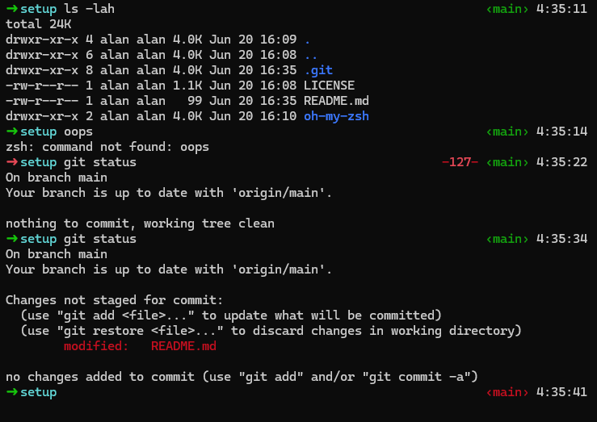

# oh-my-zsh
[oh-my-zsh customization docs](https://github.com/ohmyzsh/ohmyzsh/wiki/Customization)
## Themes
Put the theme file in `~/.oh-my-zsh/custom/theme` \
Change `ZSH_THEME` in `~/.zshrc`
*  `littleguy.zsh-theme` &rarr; `ZSH_THEME="littleguy"`
### littleguy
